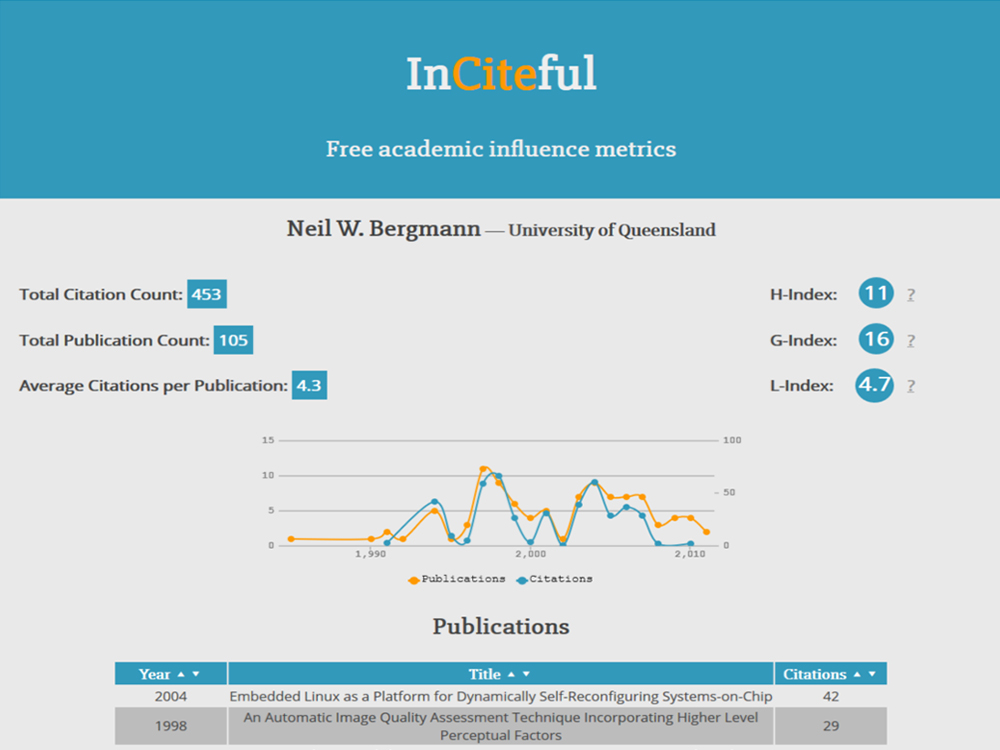

# UQCS Website
[uqcs.org.au](https://uqcs.org.au)

## Showcasing your project

Would you like to showcase your project? If so please produce a high
quality image of size 1000x750px and add it to `img/showcase/`.

Once you've produced the image add the below snippet to 
`_includes/showcase_content.html` replacing [Project Title], [URL], and
[Description] with your own information.

```
<div class="col s12 m6 l4">
  <div class="card small">
    <div class="card-image waves-effect waves-block waves-light">
      
    </div>
    <div class="card-content">
      <span class="card-title activator grey-text text-darken-4">
          [Project Title]
          <i class="material-icons right">more_vert</i></span>
      <p><a href="#">[URL]</a></p>
    </div>
    <div class="card-reveal">
    <span class="card-title grey-text text-darken-4">
        [Project Title]
        <i class="material-icons right">close</i>
    </span>
      <p>
        [Description]
      </p>
    </div>
  </div>
</div>
```

Done that? Now just send us a pull request! Don't know how? 
Email me at dmarj97@gmail.com for help.


## Copyright
Copyright (c) 2016 UQ Computing Society